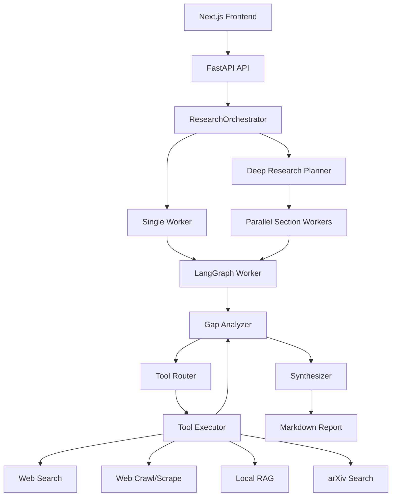

# Agentic AI Research Assistant - Project Context

## Project Goal

This project is an Agentic AI Research Assistant intended for a college Agentic AI expo presentation. It is being built by a team of 5 as a polished, industry-grade web application for professional research assistance.

The current app is a LangGraph-based rewrite/translation of an existing GitHub project originally built around the OpenAI SDK Agents pattern. The new version uses Google Gemini models and a custom LangGraph orchestration architecture.

The desired product identity is:

- Professional research assistant web app.
- Agentic, multi-step research workflow.
- Web search, targeted website scraping, arXiv academic paper discovery, and local PDF/RAG support.
- Markdown report generation with citations.
- Expo-ready demo experience with clear UI, reliable fallbacks, and a strong architecture story.

## Repository Layout

Root:

- `README.md`: high-level project README.
- `docker-compose.yml`: Compose setup for backend/frontend containers.
- `dcommands.md`: Docker command notes.
- `.gitignore`: ignores env files, Python/Node build artifacts, Chroma DB, scraper cache DB, etc.
- `AGENTS.md`: this context handoff file.

Backend:

- `backend/api.py`: FastAPI app and API endpoints.
- `backend/requirements.txt`: Python dependencies.
- `backend/Dockerfile`: backend container.
- `backend/.env`: ignored local env file containing `GEMINI_API_KEY` and `SERPER_API_KEY`.
- `backend/core_engine/`: LangGraph research engine.

Frontend:

- `frontend/src/app/page.tsx`: main research dashboard.
- `frontend/src/app/history/page.tsx`: local research history page.
- `frontend/src/app/layout.tsx`: root layout and metadata.
- `frontend/src/app/globals.css`: Tailwind/global styling.
- `frontend/package.json`: Next/React dependencies and scripts.
- `frontend/.env.local`: ignored local file with `NEXT_PUBLIC_API_URL=http://localhost:8000/api`.
- `frontend/Dockerfile`: frontend container.

## Runtime Commands

The user runs the app manually in split terminals.

Backend:

```bash
cd D:\agenticAI\ai-research-agent\backend
uvicorn api:app --reload
```

Frontend:

```bash
cd D:\agenticAI\ai-research-agent\frontend
npm run dev
```

Frontend should run at:

```text
http://localhost:3000
```

Backend should run at:

```text
http://127.0.0.1:8000
```

Do not attempt to run the project inside the Codex sandbox unless explicitly requested. Previous attempts hit environment/sandbox issues and were not reliable.

## Environment Variables

Backend expects:

```env
GEMINI_API_KEY=...
SERPER_API_KEY=...
```

Frontend expects:

```env
NEXT_PUBLIC_API_URL=http://localhost:8000/api
```

The frontend reads this through:

```ts
process.env.NEXT_PUBLIC_API_URL
```

## Backend API

Main file: `backend/api.py`

FastAPI app exposes:

- `POST /api/research`
- `POST /api/upload-pdf`

`/api/research` accepts:

```json
{
  "query": "research topic",
  "mode": "single" | "deep"
}
```

Research modes:

- `single`: runs one iterative LangGraph worker.
- `deep`: planner creates 3-4 sections and the orchestrator runs section workers concurrently.

`/api/upload-pdf`:

- Accepts only PDF uploads.
- Uses `werkzeug.utils.secure_filename`.
- Validates the sanitized filename extension.
- Saves uploads to a unique UUID-prefixed file inside an OS temp directory.
- Cleans temporary upload directory in `finally`.
- Ingests PDF into ChromaDB via `ingest_pdf_to_chroma`.

Security improvement already made:

- Removed unsafe direct write to `./{file.filename}`.

Remaining production hardening:

- CORS currently allows `*`.
- No file size limit on uploads.
- No auth.
- Error responses can expose internal exception text.

## Backend Architecture

The main backend architecture is:



## LangGraph Worker

Main file: `backend/core_engine/loop_worker.py`

Graph nodes:

- `evaluate_gaps`: calls `gap_analyzer_node`.
- `route_tools`: calls `tool_router_node`.
- `execute_tools`: custom async executor dispatches selected tools.
- `synthesize`: calls `synthesizer_node`.

Graph flow:

```text
evaluate_gaps -> route_tools -> execute_tools -> evaluate_gaps -> synthesize -> END
```

Stopping logic:

- If `research_complete` is true, synthesize.
- If `loop_count >= 3`, force synthesis to prevent infinite loops/API burn.
- Otherwise fetch more data.

Current executor supports:

- `web_searcher`
- `web_crawler`
- `rag_retriever`
- `arxiv_researcher`

## Shared Research State

File: `backend/core_engine/nodes/base_node.py`

`ResearchState` contains:

- `query`
- `current_section_title`
- `current_section`
- `research_history`
- `research_complete`
- `current_gaps`
- `pending_tool_tasks`
- `completed_sections`
- `loop_count`

Important: `research_history` uses LangGraph `Annotated[str, operator.add]`, so returned strings are appended by the graph.

## Orchestrator

File: `backend/core_engine/orchestrator.py`

`ResearchOrchestrator`:

- Precompiles the worker graph once.
- `run_single_research(query)`: creates a single worker state and invokes graph once.
- `run_deep_research(query)`: calls strategy planner, then runs workers for each planned section.

Deep research:

- Uses `strategy_planner_node`.
- Planner is instructed to generate max 3-4 sections.
- Uses an `asyncio.Semaphore(2)` to limit concurrent section workers.
- Uses `asyncio.gather`.
- Cancels pending workers if one fails.

## LLM Router

File: `backend/core_engine/llm_router.py`

The project currently uses Google Gemini models through:

```python
langchain_google_genai.ChatGoogleGenerativeAI
```

The model choices may have been downgraded to Gemini Flash variants based on Gemini Pro advice for latency/cost/reliability. Do not assume older comments are accurate; inspect the file before editing.

Historically the router had:

- Fast model: Gemini 2.5 Flash.
- Main model: Gemini 2.5 Pro.
- Reasoning model: Gemini 2.5 Pro higher temperature.
- Routing model: Gemini 2.5 Pro zero temperature.

But user reports model downgrades were recently done, particularly in `llm_router.py`. Always respect the current file contents unless asked to change models.

Do not reintroduce Groq/Llama references. Stale Groq/Llama comments were previously cleaned up.

## Core Nodes

### Strategy Planner

File: `backend/core_engine/nodes/strategy_planner.py`

Purpose:

- Takes a broad query.
- Produces a structured `ReportPlan`.
- Breaks deep research into 3-4 sections.

Schemas:

- `ReportPlanSection`
- `ReportPlan`

Uses structured LLM output.

### Gap Analyzer

File: `backend/core_engine/nodes/gap_analyzer.py`

Purpose:

- Reviews `research_history` against the current section question.
- Decides if enough evidence exists.
- Returns `research_complete` and up to 3 outstanding gaps.

Schema:

- `KnowledgeGapOutput`

Has fallback behavior:

- If structured parsing fails, it currently forces `research_complete=True` and no gaps.

### Tool Router

File: `backend/core_engine/nodes/tool_router.py`

Purpose:

- Maps gaps to tool tasks.
- Uses structured output schema `ToolSelectionPlan`.

Tool schema:

- `ToolTask`
  - `gap`
  - `tool_name`
  - `query`
  - `entity_website`

Allowed tool names:

- `web_searcher`
- `web_crawler`
- `rag_retriever`
- `arxiv_researcher`

Important recent bug:

- Router prompt previously had literal `{` / `}` text, causing LangChain prompt-template error:

```text
expected '}' before end of string
```

This was fixed by changing the wording to avoid literal braces:

```text
Your entire response must be a JSON object or JSON array.
```

Important fallback issue:

- Router previously returned `ToolSelectionPlan(tasks=[])` on failure.
- That caused loop behavior:

```text
Selected 0 tools to execute.
Firing 0 tools concurrently...
```

Patch intent:

- Log the actual exception.
- Use deterministic fallback plan.
- If query/gaps mention academic papers/research/preprints/arXiv, choose `arxiv_researcher`.
- Also choose `web_searcher`.

Check `tool_router.py` to confirm this fallback is present and clean. There may still be an old noisy print line from a partial patch; remove it if needed.

### Synthesizer

File: `backend/core_engine/nodes/synthesizer.py`

Purpose:

- Consumes accumulated findings.
- Writes final Markdown.
- Must use only provided findings.
- Adds references.

Prompt asks for professional academic Markdown with numbered citations and a References section.

## Tool Utilities

### Web Search

Files:

- `backend/core_engine/nodes/actions/web_searcher.py`
- `backend/core_engine/utilities/google_search.py`

Flow:

1. `execute_search_action(gap, query)` calls utility `web_searcher`.
2. `web_searcher` calls Serper API.
3. Scrapes top 3 organic result URLs using `aiohttp`.
4. Extracts `h1`, `h2`, `h3`, `p`, `li`.
5. Limits content to 8000 chars per page.
6. Summarizes raw text through fast model into clean cited summary.

`google_search.py` now integrates local SQLite cache:

- Checks `get_cached_content(url)` before HTTP GET.
- Saves formatted scraped content with `save_to_cache(url, formatted_content)`.

### Targeted Web Crawler

Files:

- `backend/core_engine/nodes/actions/web_scraper.py`
- `backend/core_engine/utilities/web_crawler.py`

Flow:

1. `execute_scrape_action(gap, target_url)` calls `web_crawler`.
2. `web_crawler` normalizes missing protocol to `https://`.
3. Performs same-domain BFS.
4. Crawls up to `MAX_PAGES_TO_CRAWL = 3`.
5. Extracts semantic tags.
6. Summarizes through fast model.

Cache behavior:

- Checks cache for normalized starting URL before crawl.
- Saves the final compiled crawl output under the starting URL.
- It does not cache each BFS page because the cache schema stores only `content`, not discovered links.

### RAG Retriever

Files:

- `backend/core_engine/nodes/actions/rag_retriever.py`
- `backend/core_engine/utilities/vector_db.py`

Flow:

1. `retrieve_context(query)` uses Chroma similarity search.
2. Retrieves top `k=3` chunks.
3. Action wrapper summarizes chunks using fast model.

Chroma path:

```python
CHROMA_PATH = "./chroma_db"
```

PDF ingestion:

- Uses `PyPDFLoader`.
- Uses `RecursiveCharacterTextSplitter`.
- Chunk size 1000, overlap 200.
- Embeddings: `GoogleGenerativeAIEmbeddings(model="models/text-embedding-004")`.

### arXiv Search

File:

- `backend/core_engine/utilities/arxiv_search.py`

Tool:

```python
@tool
def arxiv_researcher(query: str) -> str:
```

Requirements implemented:

- Uses built-in `urllib.request`.
- Uses built-in `urllib.parse`.
- Uses built-in `xml.etree.ElementTree`.
- Does not require extra pip packages.
- Calls official arXiv API:

```text
http://export.arxiv.org/api/query?search_query=all:{query}&start=0&max_results=3
```

Extracts:

- title
- published date
- authors
- summary/abstract
- arXiv URL

Returns clean Markdown-like string for LangGraph state.

Integration:

- Imported in `loop_worker.py`:

```python
from core_engine.utilities.arxiv_search import arxiv_researcher
```

- Executor branch:

```python
elif task.tool_name == "arxiv_researcher":
    result = await arxiv_researcher.ainvoke({"query": task.query})
    return f"--- ARXIV RESEARCH RESULTS FOR '{task.query}' ---\n{result}"
```

## Local SQLite Scraper Cache

File:

- `backend/core_engine/utilities/cache_manager.py`

Purpose:

- Reduce redundant network fetches and API latency.
- Cache scraped content locally by URL.

Uses only built-in `sqlite3`.

Database:

```text
backend/core_engine/utilities/scraper_cache.db
```

Table:

```sql
CREATE TABLE IF NOT EXISTS scraper_cache (
    url TEXT PRIMARY KEY,
    content TEXT NOT NULL,
    timestamp DATETIME NOT NULL
)
```

Functions:

```python
get_cached_content(url, max_age_hours=24)
save_to_cache(url, content)
```

The DB file should stay untracked. `.gitignore` includes:

```text
scraper_cache.db
```

Potential future improvement:

- Store cache DB in `backend/cache/` or root runtime directory instead of inside source tree.
- Add cache pruning.
- Cache Serper search responses separately from page scrapes.

## Frontend

Main dashboard:

- `frontend/src/app/page.tsx`

Features:

- Query input.
- Mode selector:
  - Flash Agent / `single`
  - Deep Parallel / `deep`
- Loading status sequence.
- PDF upload to RAG.
- Markdown report rendering with `react-markdown` and `remark-gfm`.
- Download report as Markdown.
- Save report to browser `localStorage`.

API URL:

```ts
const API_URL = process.env.NEXT_PUBLIC_API_URL || "http://localhost:8000/api";
```

History page:

- `frontend/src/app/history/page.tsx`

Features:

- Reads `agenticHistory` from localStorage.
- Shows saved reports in grid.
- Opens report modal.
- Clears archive.

Known frontend issues:

- Lint warnings existed:
  - missing `statusMessages` hook dependency.
  - unused `error` variables.
- UI is dark slate/blue style and demo-friendly, but could use more polish for an industry-grade product.
- Metadata still may be default Create Next App in `layout.tsx`; should update title/description.

## Recent Changes Already Made

Security:

- Hardened PDF upload path with temp dir, secure filename, UUID prefix, cleanup.
- Added `werkzeug` dependency.

Configuration:

- Frontend API URL moved to `NEXT_PUBLIC_API_URL`.
- Created ignored `frontend/.env.local`.

Docs/comments:

- Removed stale Groq/Llama comments.
- Updated LLM comments toward Gemini architecture.
- Removed obsolete `langchain-groq` dependency from requirements.

Caching:

- Added SQLite scraper cache.
- Integrated cache into web search scraping.
- Integrated cache into targeted crawler.

arXiv:

- Added `arxiv_researcher` tool.
- Added tool to router prompt.
- Added executor branch in loop worker.

Router:

- Fixed literal brace prompt-template crash.
- Added/attempted deterministic fallback to avoid zero-tool loops.

## Known Current Debug Thread

User ran backend successfully:

```text
uvicorn api:app --reload
```

App startup succeeded:

```text
Application startup complete.
```

Then query:

```text
Research the latest advancements in Agentic AI and LangGraph architectures. Pull recent academic papers to support the findings'
```

Note: query log showed an extra trailing `'`:

```text
findings''
```

Observed issue:

```text
[Tool Router] LLM parsing glitch detected. Deploying safety hatch.
Selected 0 tools to execute.
Firing 0 tools concurrently...
```

Meaning:

- The router structured LLM call failed.
- Safety hatch returned zero tasks.
- Worker loop collected no data.

Fix direction:

- Ensure `tool_router.py` logs the actual exception.
- Ensure fallback plan returns `arxiv_researcher` and `web_searcher` for paper/research queries.
- Remove old misleading fallback print if still present.
- Restart backend or rely on `--reload`.

## Expo Demo Priorities

Highest priority:

1. Make one single-mode demo query reliable.
2. Make arXiv + web search visibly run.
3. Make final report coherent with citations.
4. Improve progress visibility in frontend.
5. Ensure PDF upload demo works with a small known PDF.

Recommended demo query:

```text
Research recent advancements in Agentic AI and LangGraph architectures. Include recent academic papers and practical system design patterns.
```

Avoid overly broad, highly current, or API-expensive demo queries.

Suggested presentation story:

- “This is a LangGraph multi-agent research system.”
- “The Gap Analyzer decides what is missing.”
- “The Tool Router selects the right tool: web, arXiv, local RAG, or crawler.”
- “Tools execute concurrently.”
- “The loop repeats until enough evidence exists.”
- “The Synthesizer writes a cited Markdown research report.”
- “Deep Parallel mode decomposes large topics into sections and runs multiple workers.”

## Product Roadmap

### Must Fix Before Expo

- Router should not return zero tools on failure.
- Validate arXiv tool works from backend runtime.
- Ensure `tool_router.py` fallback is clean and logs useful exception.
- Ensure frontend can submit request and show report.
- Fix obvious metadata/title in frontend.
- Prepare a known-good demo query.
- Prepare fallback screenshots or recorded run if college Wi-Fi/API quota fails.

### Expo Polish

- Add real-time backend progress streaming or polling.
- Show selected tools in UI.
- Show citations/sources in a nicer panel.
- Add “Academic mode” toggle that biases arXiv/RAG.
- Add “Sources used” section outside report.
- Add empty/error states that look professional.
- Make loading statuses reflect actual backend stages if possible.

### Production Hardening

- Auth.
- Per-user history backend instead of localStorage.
- Rate limiting.
- Upload size/type validation.
- Safer CORS.
- API timeouts/cancellation.
- Structured logging.
- Background jobs for long research runs.
- Persistent database for reports.
- Tests.
- Configurable model names via env vars.
- Cache pruning and cache directory config.

## Important Working Rules For Future Agents

- Do not run the project inside Codex unless the user explicitly asks. The user prefers running it locally.
- Do not change code when the user says they only want review/context.
- Use `apply_patch` for edits.
- Preserve user/Gemini changes.
- Always inspect current file contents before assuming model names or architecture.
- Do not reintroduce OpenAI SDK, Groq, or Llama assumptions unless the user asks.
- Treat this as an expo-bound product: reliability and demo clarity matter as much as architecture.
- When debugging logs, prefer precise minimal patches over broad rewrites.

